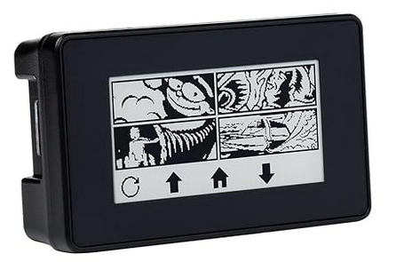
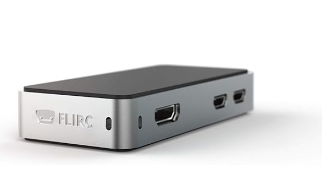
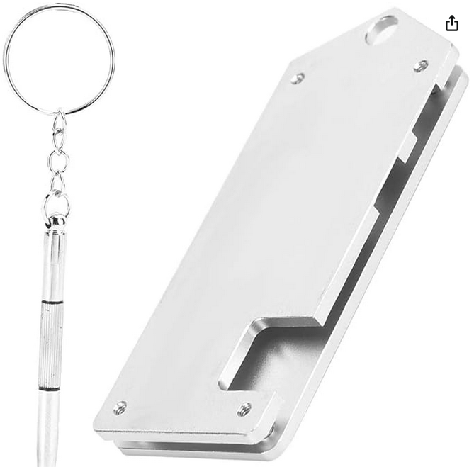

# Secured Wisker KeyBox (SW-KeyBox)

### Hardware

Raspberry Pi Zero 2W(H)

### Choix du système d'exploitation

**Debian**
- Certaines versions peuvent être lourdes pour un Raspberry Pi Zero 2W

**Armbian**
- Optimisé et performant

**Alpine**
- Très optimisé mais complexe à configurer

---

``Ca sera ArmBian``

### Alimentation

**Problématique:** Comment alimenter l'appareil de manière simple et fiable?

#### Options d'alimentation disponibles

**USB 2.0**
- 5V × 0,5A max = 2,5W

**USB 3.0 / 3.1 / 3.2**
- 5V × 0,9A max = 4,5W

**USB-C (sans Power Delivery)**
- 5V × 1,5A à 3A selon le port = 7,5W à 15W

**USB-C téléphone (sans charge inversée)**
- 5V × 0,5A à 1A = 2,5W à 5W
- Disponible sur la majorité des téléphones

> **Note:** En pratique, un Pi Zero 2W seul (sans périphériques USB gourmands et avec WiFi) fonctionne généralement avec ~5V et 0,5A ou moins la plupart du temps, soit environ 2,5W. L'alimentation USB 2.0 standard devrait suffire.

``Globalement viable``

### Stack technique

- **Runtime:** Node.js + NPM
- **Interface:** Python pour la gestion de l'écran e-Paper

## Interface utilisateur

### Option 1: Écran e-Paper
Géré en Python via le [2.13inch e-Paper HAT API](https://www.waveshare.com/wiki/2.13inch_Touch_e-Paper_HAT_Manual#Python_.28Used_for_Raspberry_Pi.29)

### Option 2: Mode "headless"

## Connexion Bluetooth

### Serveur Bluetooth
Utilisation de [@abandonware/bleno](https://github.com/abandonware/bleno), un serveur Bluetooth BLE (Bluetooth Low Energy)

### Accès depuis PWA/Web

**API:** Web Bluetooth de JavaScript

**Compatibilité navigateurs:**

| Navigateur | Support |
|------------|---------|
| Chrome (Android) | ✅ Oui |
| Chrome (Desktop) | ⚠️ Oui, mais dépend de l'OS (pas sur iOS) |
| Edge | ✅ Oui |
| Opera | ✅ Oui |
| Safari | ❌ Non (pas encore officiellement) |
| iOS (tous navigateurs) | ❌ Non (limité par WebKit d'Apple) |

### Sécurisation de la connexion Bluetooth

**🔹 BLE "Just Works"**
- Connexion automatique sans code PIN
- ✅ Très simple
- ❌ Vulnérable aux attaques MITM (Man-in-the-Middle)

**🔹 BLE avec code PIN ou "Passkey"**
- Appairage avec un code à 6 chiffres
- ✅ Sécurisé contre MITM
- ✅ Chiffrement AES-CCM activé après appairage

**🔹 BLE "Numeric Comparison" / "Out of Band"**
- Comparaison numérique affichée sur les deux appareils ou clé OOB (QR code/NFC)
- ✅ Très sécurisé
- ✅ Protection contre MITM

## Sécurité des données

Les clés privées et publiques seront stockées sous forme chiffrée (chiffrement effectué depuis le frontend de l'utilisateur) dans un fichier JSON accompagné des métadonnées nécessaires.

# Pourquoi  

Actuellement, les clés de chiffrement sont générées lors de l'inscription et stockées en clair dans IndexedDB.

Les clés de chiffrement permettant de déchiffrer les messages sont stockées dans le navigateur. Pour se connecter sur un autre navigateur, il faut effectuer un transfert de clés via un système sécurisé utilisant un QR code ou un texte à copier-coller.

L'avantage est qu'on peut utiliser l'application sur plusieurs appareils simultanément, mais cela nécessite un transfert d'informations passant par le serveur. Si le PC est compromis, la clé peut être récupérée.

Par ailleurs, on peut être amené à se connecter au compte depuis un appareil qui ne nous appartient pas.

Avec la SW-KeyBox, une option permettra de transférer les clés de chiffrement directement dans la SW-KeyBox et de les retirer d'IndexedDB. Lorsque les messages devront être déchiffrés, la clé sera directement récupérée via Bluetooth depuis la SW-KeyBox.

# Fonctionnement

Fonctionnalités prévues :
- Connexion Bluetooth
- Transfert des clés
- Utilisation des clés
- Rapatriement des clés sur un navigateur

---

Il y a encore pas mal d'inconnues sur comment tout ça marchera exactement car je n'ai jamais jouer avec le Bluetooth ou avec un raspberry PI 0.

Ce qui me fera apprendre sur ces deux points en plus d'avoir un produit physique au lieu d'un SaaS. 😊 

A vous de me dire si cela peut correspondre à ce qui est demander par le certificateur.