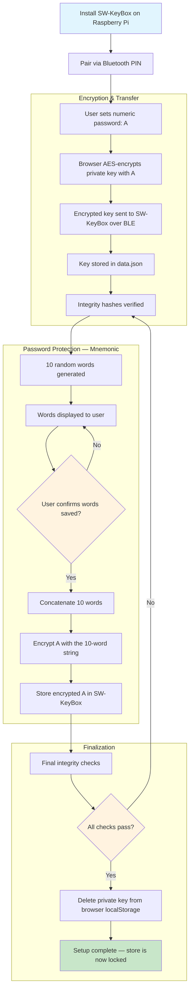

# SW-KeyBox — Technical Documentation

## Table of Contents

- [Architecture Overview](#architecture-overview)
- [Hardware Stack](#hardware-stack)
- [Software Stack](#software-stack)
- [Project Structure](#project-structure)
- [Module Breakdown](#module-breakdown)
- [BLE Protocol](#ble-protocol)
- [Data Model](#data-model)
- [Key Storage & Security Flow](#key-storage--security-flow)
- [e-Paper Display](#e-paper-display)
- [System Service](#system-service)

---

## Architecture Overview

SW-KeyBox runs as a standalone Python application on a Raspberry Pi Zero 2W. It exposes a **BLE GATT server** that any paired client (browser extension, mobile app) can connect to in order to read or write cryptographic key material. The device maintains a persistent local JSON store and shows status information on a 2.13" e-Paper touchscreen.

```
┌─────────────────────────────────┐
│         Client (Browser)        │
│  - Encrypts private key (AES)   │
│  - Connects via BLE             │
└────────────────┬────────────────┘
                 │ Bluetooth Low Energy (GATT)
┌────────────────▼────────────────┐
│         SW-KeyBox Device        │
│  ┌──────────────────────────┐   │
│  │     bluetoothManager.py  │   │  ← BLE GATT server (BlueZ / D-Bus)
│  └──────────┬───────────────┘   │
│             │                   │
│  ┌──────────▼───────────────┐   │
│  │       dataManager.py     │   │  ← Business logic & data validation
│  └──────────┬───────────────┘   │
│             │                   │
│  ┌──────────▼───────────────┐   │
│  │       JsonManager.py     │   │  ← Thread-safe JSON persistence
│  └──────────────────────────┘   │
│                                 │
│  ┌──────────────────────────┐   │
│  │      screenManager.py    │   │  ← e-Paper display rendering
│  └──────────────────────────┘   │
│                                 │
│  ┌──────────────────────────┐   │
│  │         main.py          │   │  ← Entry point, orchestration
│  └──────────────────────────┘   │
└─────────────────────────────────┘
```

---

## Hardware Stack

| Component | Specification |
|---|---|
| **SBC** | Raspberry Pi Zero 2W(H) — quad-core ARM Cortex-A53 @ 1GHz, 512MB RAM |
| **OS** | Debian / Raspberry Pi OS Lite (64-bit) |
| **Display** | Waveshare 2.13" Touch e-Paper HAT (V4) — 250×122 px, SPI, partial refresh |
| **Touchscreen** | GT1151 capacitive touch controller (I2C) |
| **Wireless** | Bluetooth 4.2 (onboard BCM43438) |
| **Power** | Micro-USB (5V), ultra-low idle power thanks to e-Paper display |

---

## Software Stack

| Layer | Technology |
|---|---|
| **Language** | Python 3 |
| **BLE stack** | BlueZ (Linux Bluetooth) via D-Bus |
| **D-Bus binding** | [`dbus-next`](https://github.com/altdesktop/python-dbus-next) (async, bundled in `lib/`) |
| **e-Paper driver** | Waveshare `TP_lib` (bundled in `lib/TP_lib/`) |
| **Image rendering** | Pillow (PIL) |
| **Async runtime** | `asyncio` |
| **Threading** | `threading` (touch interrupt polling) |
| **Persistence** | JSON file (`data.json`) with `fcntl` file locking |
| **Integrity checks** | MD5 hashes stored alongside key material |
| **System service** | systemd unit (`sw-keybox.service`) |

---

## Project Structure

```
SecuredWhisker-keybox/
├── programme/
│   ├── main.py              # Entry point — orchestrates display, BLE, events
│   ├── bluetoothManager.py  # BLE GATT server, D-Bus integration
│   ├── dataManager.py       # Domain logic: get/set/verify key material
│   ├── JsonManager.py       # Thread-safe JSON read/write with file locking
│   └── data.example.json    # Example JSON data schema
├── lib/
│   ├── dbus_next/           # Bundled dbus-next library
│   └── TP_lib/              # Waveshare e-Paper HAT drivers
│       ├── epd2in13_V4.py   # EPD driver (SPI)
│       ├── epdconfig.py     # GPIO/SPI config
│       ├── gt1151.py        # GT1151 touch controller driver
│       └── icnt86.py        # Alternative touch controller
├── font/
│   └── Font.ttc             # TrueType font for e-Paper text rendering
├── pics/                    # Assets for display
├── sw-keybox.service        # systemd service unit
├── setup.py                 # Setup script
└── setup.sh                 # Shell setup helper
```

---

## Module Breakdown

### `main.py` — Orchestrator

The entry point of the application. Responsibilities:
- Initializes the e-Paper display and GT1151 touch controller
- Starts the touch polling thread (interrupt-driven via GPIO)
- Defines display state functions (`show_waiting_screen`, `show_pairing_code`, `show_connected`, `show_key_status`)
- Launches the BLE GATT server via `bluetoothManager`
- Passes display callbacks into the BLE manager so UI updates happen in response to BLE events

### `bluetoothManager.py` — BLE GATT Server

Implements a BLE GATT server using **BlueZ over D-Bus** (via `dbus-next` async API). Key components:

- **`Characteristic`** (`org.bluez.GattCharacteristic1`) — the single GATT characteristic:
  - `ReadValue` — returns the current `{initialized, iv, public, private}` JSON payload
  - `WriteValue` — receives chunked JSON actions from the client
- **GATT Service** — wraps the characteristic at a fixed GATT service UUID
- **BLE Advertisement** — broadcasts the device as `SW-Keybox` for discovery
- **BLE Agent** — handles pairing with PIN confirmation
- **Chunked write protocol** — large payloads (e.g. long public keys) are split into 490-byte chunks and reassembled on the device

**UUIDs:**

```
Service UUID:     12345678-1234-5678-1234-56789abcdef0
Characteristic:   12345678-1234-5678-1234-56789abcdef1
```

### `dataManager.py` — Business Logic

Provides a clean API over `JsonManager` with enforced security rules:

- `get_secrets()` — returns `{initialized, iv, public, private}`
- `set_iv(iv)` — stores the IV; **blocked if already initialized**
- `concat_public(chunk)` / `concat_private(chunk)` — appends key chunks; **blocked if already initialized**
- `set_initialized(True)` — locks the store permanently
- `verify_iv()` / `verify_public()` / `verify_private()` — validates stored values against their MD5 hashes
- `verify_all()` — runs all integrity checks

> **Security invariant:** Once `initialized` is set to `true`, no key material can be overwritten. This prevents any attempt to silently replace stored keys after initial setup.

### `JsonManager.py` — Persistence Layer

Thread-safe JSON file manager using `fcntl` advisory locks:

- `get_all_json()` — reads `data.json` with a shared read lock
- `update_value(key_path, value)` — updates a nested key path (e.g. `"keypair.public"`) using an exclusive write lock and **atomic write via `tempfile`** to prevent data corruption

### `screenManager.py` — e-Paper Display

Renders text onto the 2.13" e-Paper display using partial refresh (no full-screen flash):

- `printText(epd, text, x, y)` — single-line text rendering
- `printLines(epd, lines, x, y, ...)` — multi-line text block rendering
- `clearNoFlash(epd)` — clears display without the slow full-refresh flash
- Uses Pillow to compose `1-bit` monochrome images before sending to the EPD buffer

---

## BLE Protocol

Communication follows a simple JSON-over-GATT protocol on a single read/write characteristic.

### Read (client → device)

A `ReadValue` returns a JSON-encoded snapshot of the device state:

```json
{
  "initialized": false,
  "iv": null,
  "public": null,
  "private": null
}
```

Or after initialization:

```json
{
  "initialized": true,
  "iv": "<base64-encoded IV>",
  "public": "<base64-encoded public key>",
  "private": "<base64-encoded encrypted private key>"
}
```

### Write (device ← client)

Writes use action-based JSON payloads. Each write is a single JSON object:

| Action | Payload | Description |
|---|---|---|
| `set_iv` | `{"action": "set_iv", "data": "<iv>"}` | Store the AES IV |
| `concat_public` | `{"action": "concat_public", "data": "<chunk>"}` | Append a chunk to the public key |
| `concat_private` | `{"action": "concat_private", "data": "<chunk>"}` | Append a chunk to the private key |
| `set_hash_iv` | `{"action": "set_hash_iv", "data": "<md5>"}` | Store the IV integrity hash |
| `set_hash_public` | `{"action": "set_hash_public", "data": "<md5>"}` | Store the public key hash |
| `set_hash_private` | `{"action": "set_hash_private", "data": "<md5>"}` | Store the private key hash |
| `initialized` | `{"action": "initialized"}` | Lock the store — triggers verification |

> **Chunk size:** 490 bytes per BLE write. Long keys are split by the client and reassembled using `concat_*` actions.

---

## Data Model

Keys are persisted in `programme/data.json`:

```json
{
  "initialized": false,
  "iv": null,
  "keypair": {
    "public": null,
    "private": null
  },
  "hash": {
    "allHashCorresponding": false,
    "iv": null,
    "keypair": {
      "public": null,
      "private": null
    }
  }
}
```

| Field | Type | Description |
|---|---|---|
| `initialized` | `bool` | When `true`, all write operations are permanently blocked |
| `iv` | `string` | Base64-encoded AES initialization vector |
| `keypair.public` | `string` | Base64-encoded public key |
| `keypair.private` | `string` | AES-encrypted private key (encrypted by the user's PIN) |
| `hash.*` | `string` | MD5 hashes for integrity verification of each field |

---

## Key Storage & Security Flow

### Initial Setup



### Decryption Flow (runtime)

1. Client connects via BLE, authenticates with pairing PIN
2. Client sends a read request to the GATT characteristic
3. SW-KeyBox returns the encrypted private key + IV
4. User enters their numeric password (A) — or reconstructs it from the 10-word mnemonic
5. Client decrypts the key locally in the browser
6. Message is decrypted; key is discarded from memory

> At no point does the plaintext private key leave the SW-KeyBox or travel over the network.

---

## e-Paper Display

The 2.13" Waveshare e-Paper HAT provides a low-power, always-visible status screen.

### Display States

| State | Screen Content |
|---|---|
| **Idle / Waiting** | `SW Keybox` banner + `Prêt pour apairage (pairing BLE)` |
| **Pairing** | `SW-Keybox` + `Code BLE:` + pairing PIN |
| **Connected** | Connected device MAC address |
| **Key status** | Whether the key store is initialized or empty |

### Rendering

Display updates use **partial refresh** (`TurnOnDisplayPart`) to avoid the slow full-screen flash typical of e-Paper. The `screenManager.printLines()` function composes a 1-bit Pillow image and sends it directly via SPI using the EPD's `WRITE_RAM` command.

---

## System Service

SW-KeyBox runs automatically at boot via a **systemd service unit** (`sw-keybox.service`). This ensures the BLE GATT server is always available without requiring a manual login.

To install:

```bash
bash setup.sh
```

To manage the service:

```bash
sudo systemctl status sw-keybox
sudo systemctl restart sw-keybox
sudo journalctl -u sw-keybox -f   # live logs
```
