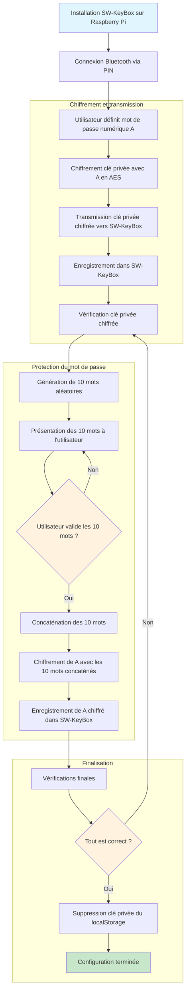

- Installation de sw-keybox sur raspberry pi 0 2wh
- Connexion SW à sw-keybox via pin de connexion bluetooth
- Enregistrement de la clé privée du navigateur au SW-key box :
    - Utilisateur définit un mot de passe numérique (A) 
    - Clé privée chiffrée en AES avec "A"
    - Clé privée chiffrée transmise et enregistrée dans sw-keybox
    - Vérification de la clé privée chiffrée
    - "A" chiffré avec 10 mots
    - Ces 10 mots sont présentés à l'utilisateur
    - Validation de l'utilisateur quand ces 10 mots sont enregistrés
    - Chiffrement de "A" avec concaténation de ces 10 mots
    - Enregistrement de "A" chiffré avec les 10 mots 
    - Vérifications
    - Suppression de la clé privée du localStorage

## Diagramme de flux - Configuration SW-KeyBox

